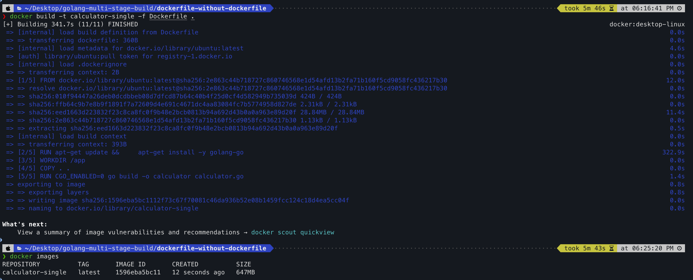
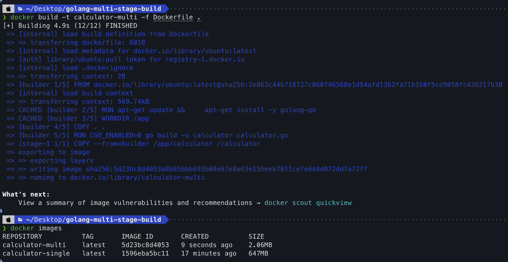

# My Go Calculator App

This is a simple calculator application written in Go. The project demonstrates how to use both single-stage and multi-stage Docker builds and explain the benefits of multi-stage.
## Prerequisites

- [Go](https://golang.org/dl/)
- [Docker](https://www.docker.com/get-started)

## Running the Application

## Clone the Repository

First, clone the repository to your local machine:

```sh
git clone https://github.com/kcubez-edu/Golang-multistage-build-docker.git

cd golang-multistage-build-docker
```

### Without Multi-Stage Docker Build

1. Navigate to the dockerfile-without-multistage directory:
   ```sh
   cd dockerfile-without-multistage
   ```

2. Build the Docker image:
    ```sh
    docker build -t calculator-single -f Dockerfile .
    ```
3. Navigate Docker image
    ```sh
    docker images
    ```
   

    ### We can see the size of image (647 MB) without using multi-stage docker.

4. Run the Docker container:
    ```sh
    docker run -it calculator-single
    ```
5. Return to the root directory:
    ```sh
    cd ..
    ```

### With Multi-Stage Docker Build

1. Build the Docker image:
    ```sh
    docker build -t calculator-multi -f Dockerfile .
    ```
2. Navigate Docker image
    ```sh
    docker images
    ```
    
    
    ### Now, we can see surprisely the size of image (2.06) using multi-stage.

3. Run the Docker container:
    ```sh
    docker run -it calculator-multi
    ```

## Project Structure
```sh
golang-multi-stage-build/
├── dockerfile-without-multistage/
│   ├── calculator.go
│   ├── Dockerfile
├── calculator.go
├── Dockerfile
└── README.md
```

## Explanation

### Dockerfile (Single-Stage)

This Dockerfile uses a single stage to build and run the Go application. While straightforward, it results in a larger final image because it includes the Go build tools and source code.

### Dockerfile.multi (Multi-Stage)

This Dockerfile uses multiple stages to build the Go application in one stage and then copy the resulting binary into a minimal Ubuntu image in the final stage. This approach significantly reduces the size of the final image.

### Benefits of Multi-Stage Builds

- **Smaller Image Size**: By copying only the binary to the final image, we exclude unnecessary build tools and dependencies.
- **Improved Security**: A smaller image with fewer components reduces the attack surface.


### Reference
https://github.com/iam-veeramalla/Docker-Zero-to-Hero/blob/main/examples/golang-multi-stage-docker-build/Dockerfile